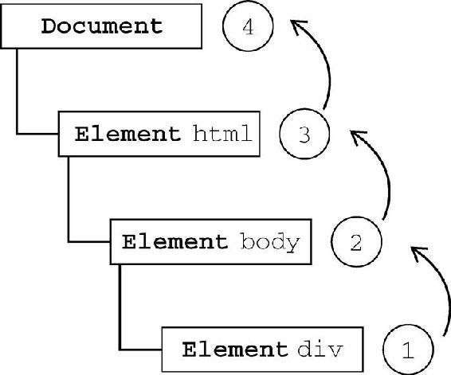
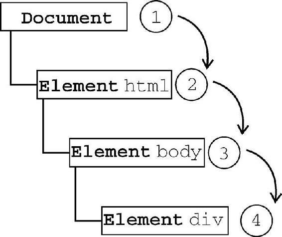

# 事件

JavaScript 程序采用了异步事件驱动编程模型。在这种程序设计风格下，当文档、浏览器、元素或与之相关的对象发生某些有趣的事情时，Web 浏览器就会产生事件（event）。例如，当 Web 浏览器加载完文档、用户把鼠标指针移到超链接上或敲击键盘时，Web 浏览器都会产生事件。如果 JavaScript 应用程序关注特定类型的事件，那么它可以注册当这类事件发生时要调用的一个或多个函数。请注意，这种风格并不只应用于 Web 编程，所有使用图形用户界面的应用程序都采用了它，它们静待某些事情发生（即，它们等待事件发生），然后它们响应。

请注意，事件本身并不是一个需要定义的技术名词。简而言之，事件就是 Web 浏览器通知应用程序发生了什么事情，这种在传统软件工程中被称为观察员模式。

## 事件流

当浏览器发展到第四代时（IE4 及 Netscape Communicator 4），浏览器开发团队遇到了一个很有意思的问题：页面的哪一部分会拥有某个特定的事件？要明白这个问题问的是什么，可以想象画在一张纸上的一组同心圆。如果你把手指放在圆心上，那么你的手指指向的不是一个圆，而是纸上的所有圆。两家公司的浏览器开发团队在看待浏览器事件方面还是一致的。如果你单击了某个按钮，他们都认为单击事件不仅仅发生在按钮上。换句话说，在单击按钮的同时，你也单击了按钮的容器元素，甚至也单击了整个页面。

**事件流**描述的是从页面中接收事件的顺序。但有意思的是，IE 和 Netscape 开发团队居然提出了差不多是完全相反的事件流的概念。IE 的事件流是事件冒泡流，而 Netscape Communicator 的事件流是事件捕获流。

### 事件冒泡

IE 的事件流叫做**事件冒泡**（event bubbling），即事件开始时由最具体的元素（文档中嵌套层次最深的那个节点）接收，然后逐级向上传播到较为不具体的节点（文档）。以下面的HTML页面为例：

```html
<!DOCTYPE html>
<html>
<head>
    <title>Event Bubbling Example</title>
</head>
<body>
    <div id="myDiv">Click Me</div>
</body>
</html>
```

如果你单击了页面中的 `<div>` 元素，那么这个 `click` 事件会按照如下顺序传播：

1. `<div>`
2. `<body>`
3. `<html>`
4. `document`

也就是说，`click` 事件首先在 `<div>` 元素上发生，而这个元素就是我们单击的元素。然后，`click` 事件沿 DOM 树向上传播，在每一级节点上都会发生，直至传播到 `document` 对象。下图展示了事件冒泡的过程。



### 事件捕获

Netscape Communicator 团队提出的另一种事件流叫做**事件捕获**（event capturing）。事件捕获的思想是不太具体的节点应该更早接收到事件，而最具体的节点应该最后接收到事件。事件捕获的用意在于在事件到达预定目标之前捕获它。如果仍以前面的 HTML 页面作为演示事件捕获的例子，那么单击 `<div>` 元素就会以下列顺序触发 `click` 事件。

1. `document`
2. `<html>`
3. `<body>`
4. `<div>`

在事件捕获过程中，`document` 对象首先接收到 `click` 事件，然后事件沿 DOM 树依次向下，一直传播到事件的实际目标，即 `<div>` 元素。下图展示了事件捕获的过程。



由于老版本的浏览器不支持，因此很少有人使用事件捕获。我们也建议大家放心地使用事件冒泡，在有特殊需要时再使用事件捕获。

## 事件处理程序

事件就是用户或浏览器自身执行的某种动作。诸如 `click`、`load` 和 `mouseover`，都是事件的名字。而响应某个事件的函数就叫做**事件处理程序**（或**事件侦听器**）。事件处理程序的名字以 `"on"` 开头，因此 `click` 事件的事件处理程序就是 `onclick`，`load` 事件的事件处理程序就是 `onload`。为事件指定处理程序的方式有好几种。

### HTML 事件处理程序

某个元素支持的每种事件，都可以使用一个与相应事件处理程序同名的 HTML 特性来指定。这个特性的值应该是能够执行的 JavaScript 代码。例如，要在按钮被单击时执行一些 JavaScript，可以像下面这样编写代码：

```html
<input type="button" value="Click Me" onclick="console.log('Clicked')" />
```

当单击这个按钮时，就会在控制台打印 `"Clicked"`。这个操作是通过指定 `onclick` 特性并将一些 JavaScript 代码作为它的值来定义的。由于这个值是 JavaScript，因此不能在其中使用未经转义的 HTML 语法字符，例如和号（&）、双引号（""）、小于号（<）或大于号（>）。为了避免使用 HTML 实体，这里使用了单引号。如果想要使用双引号，那么就要将代码改写成如下所示：

```html
<input type="button" value="Click Me" onclick="console.log(&quot;Clicked&quot;)" />
```

在 HTML 中定义的事件处理程序可以包含要执行的具体动作，也可以调用在页面其他地方定义的脚本，如下面的例子所示：

```javascript
<script type="text/javascript">
    function showMessage(){
        console.log("Hello world!");
    }
</script>
<input type="button" value="Click Me" onclick="showMessage()" />
```

在这个例子中，单击按钮就会调用 `showMessage()` 函数。这个函数是在一个独立的 `<script>` 元素中定义的，当然也可以被包含在一个外部文件中。事件处理程序中的代码在执行时，有权访问全局作用域中的任何代码。

这样指定事件处理程序具有一些独到之处。首先，这样会创建一个封装着元素属性值的函数。这个函数中有一个局部变量 `event`，也就是事件对象：

```html
<!-- 输出 "click" -->
<input type="button" value="Click Me" onclick="console.log(event.type)">
```

通过 `event` 变量，可以直接访问事件对象，你不用自己定义它，也不用从函数的参数列表中读取。

在这个函数内部，`this` 值等于事件的目标元素，例如：

```html
<!-- 输出 "Click Me" -->
<input type="button" value="Click Me" onclick="console.log(this.value)">
```

如此一来，事件处理程序要访问自己的属性就简单多了。下面这行代码与前面的例子效果相同：

```html
<!-- 输出 "Click Me" -->
<input type="button" value="Click Me" onclick="console.log(value)">
```

不过，在 HTML 中指定事件处理程序有三个缺点。首先，存在一个时差问题。因为用户可能会在 HTML 元素一出现在页面上就触发相应的事件，但当时的事件处理程序有可能尚不具备执行条件。以前面的例子来说明，假设 `showMessage()` 函数是在按钮下方、页面的最底部定义的。如果用户在页面解析 `showMessage()` 函数之前就单击了按钮，就会引发错误。为此，很多HTML事件处理程序都会被封装在一个 `try-catch` 块中，以便错误不会浮出水面，如下面的例子所示：

```html
<input type="button" value="Click Me" onclick="try{showMessage();}catch(ex){}">
```

这样，如果在 `showMessage()` 函数有定义之前单击了按钮，用户将不会看到 JavaScript 错误，因为在浏览器有机会处理错误之前，错误就被捕获了。

第二个缺点是，这样扩展事件处理程序的作用域链在不同浏览器中会导致不同结果。不同 JavaScript 引擎遵循的标识符解析规则略有差异，很可能会在访问非限定对象成员时出错。

第三个缺点是，HTML 与 JavaScript 代码紧密耦合。如果要更换事件处理程序，就要改动两个地方：HTML 代码和 JavaScript 代码。而这正是许多开发人员摒弃 HTML 事件处理程序，转而使用 JavaScript 指定事件处理程序的原因所在。

### DOM1 级事件处理程序

通过 JavaScript 指定事件处理程序的传统方式，就是将一个函数赋值给一个事件处理程序属性。这种为事件处理程序赋值的方法是在第四代Web浏览器中出现的，而且至今仍然为所有现代浏览器所支持。原因一是简单，二是具有跨浏览器的优势。要使用 JavaScript 指定事件处理程序，首先必须取得一个要操作的对象的引用。

每个元素（包括 `window` 和 `document`）都有自己的事件处理程序属性，这些属性通常全部小写，例如 `onclick`。将这种属性的值设置为一个函数，就可以指定事件处理程序，如下所示：

```javascript
var btn = document.getElementById("myBtn");
btn.onclick = function(){
    console.log("Clicked");
};
```

在此，我们通过文档对象取得了一个按钮的引用，然后为它指定了 `onclick` 事件处理程序。但要注意，在这些代码运行以前不会指定事件处理程序，因此如果这些代码在页面中位于按钮后面，就有可能在一段时间内怎么单击都没有反应。

使用 DOM1 级方法指定的事件处理程序被认为是元素的方法。因此，这时候的事件处理程序是在元素的作用域中运行；换句话说，程序中的 `this` 引用当前元素。来看一个例子。

```javascript
var btn = document.getElementById("myBtn");
btn.onclick = function(){
    console.log(this.id);    // "myBtn"
};
```

单击按钮显示的是元素的 ID，这个 ID 是通过 `this.id` 取得的。不仅仅是 ID，实际上可以在事件处理程序中通过 `this` 访问元素的任何属性和方法。以这种方式添加的事件处理程序会在事件流的冒泡阶段被处理。

也可以删除通过 DOM1 级方法指定的事件处理程序，只要像下面这样将事件处理程序属性的值设置为 `null` 即可：

```javascript
btn.onclick = null;     // 删除事件处理程序
```

将事件处理程序设置为 `null` 之后，再单击按钮将不会有任何动作发生。

### DOM2 级事件处理程序

DOM2 级事件定义了两个方法，用于处理指定和删除事件处理程序的操作：`addEventListener()` 和 `removeEventListener()`。所有 DOM 节点中都包含这两个方法，并且它们都接受3个参数：要处理的事件名、作为事件处理程序的函数和一个布尔值。最后这个布尔值参数如果是 `true`，表示在捕获阶段调用事件处理程序；如果是 `false`，表示在冒泡阶段调用事件处理程序。

要在按钮上为 `click` 事件添加事件处理程序，可以使用下列代码：

```javascript
var btn = document.getElementById("myBtn");
btn.addEventListener("click", function(){
    console.log(this.id);
}, false);
```

上面的代码为一个按钮添加了 `onclick` 事件处理程序，而且该事件会在冒泡阶段被触发（因为最后一个参数是 `false`）。与 DOM1 级方法一样，这里添加的事件处理程序也是在其依附的元素的作用域中运行。使用 DOM2 级方法添加事件处理程序的主要好处是可以添加多个事件处理程序。来看下面的例子。

```javascript
var btn = document.getElementById("myBtn");
btn.addEventListener("click", function(){
    console.log(this.id);
}, false);
btn.addEventListener("click", function(){
    console.log("Hello world!");
}, false);
```

这里为按钮添加了两个事件处理程序。这两个事件处理程序会按照添加它们的顺序触发，因此首先会显示元素的 ID，其次会显示 `"Hello world!"` 消息。

通过 `addEventListener()` 添加的事件处理程序只能使用 `removeEventListener()` 来移除；移除时传入的参数与添加处理程序时使用的参数相同。这也意味着通过 `addEventListener()` 添加的匿名函数将无法移除，如下面的例子所示。

```javascript
var btn = document.getElementById("myBtn");
btn.addEventListener("click", function(){
    console.log(this.id);
}, false);
btn.removeEventListener("click", function(){ // 没有用！
    console.log(this.id);
}, false);
```

在这个例子中，我们使用 `addEventListener()` 添加了一个事件处理程序。虽然调用 `removeEventListener()` 时看似使用了相同的参数，但实际上，第二个参数与传入 `addEventListener()` 中的那一个是完全不同的函数。而传入 `removeEventListener()` 中的事件处理程序函数必须与传 入`addEventListener()` 中的相同，如下面的例子所示。

```javascript
var btn = document.getElementById("myBtn");
var handler = function(){
    console.log(this.id);
};
btn.addEventListener("click", handler, false);
btn.removeEventListener("click", handler, false); // 有效！
```

重写后的这个例子没有问题，是因为在 `addEventListener()` 和 `removeEventListener()` 中使用了相同的函数。

大多数情况下，都是将事件处理程序添加到事件流的冒泡阶段，这样可以最大限度地兼容各种浏览器。最好只在需要在事件到达目标之前截获它的时候将事件处理程序添加到捕获阶段。如果不是特别需要，我们不建议在事件捕获阶段注册事件处理程序。

> IE9、Firefox、Safari、Chrome 和 Opera 支持 DOM2 级事件处理程序。

### IE 事件处理程序

IE 实现了与 DOM 中类似的两个方法：`attachEvent()` 和 `detachEvent()`。这两个方法接受相同的两个参数：事件处理程序名称与事件处理程序函数。由于 IE8 及更早版本只支持事件冒泡，所以通过 `attachEvent()` 添加的事件处理程序都会被添加到冒泡阶段。

要使用 `attachEvent()` 为按钮添加一个事件处理程序，可以使用以下代码。

```javascript
var btn = document.getElementById("myBtn");
btn.attachEvent("onclick", function(){
    console.log("Clicked");
});
```

注意，`attachEvent()` 的第一个参数是 `"onclick"`，而非 DOM 的 `addEventListener()` 方法中的 `"click"`。

在 IE 中使用 `attachEvent()` 与使用 DOM1 级方法的主要区别在于事件处理程序的作用域。在使用 DOM1 级方法的情况下，事件处理程序会在其所属元素的作用域内运行；在使用 `attachEvent()` 方法的情况下，事件处理程序会在全局作用域中运行，因此 `this` 等于 `window`。来看下面的例子。

```javascript
var btn = document.getElementById("myBtn");
btn.attachEvent("onclick", function(){
    console.log(this === window);    // true
});
```

在编写跨浏览器的代码时，牢记这一区别非常重要。

与 `addEventListener()` 类似，`attachEvent()` 方法也可以用来为一个元素添加多个事件处理程序。不过，与 DOM 方法不同的是，这些事件处理程序不是以添加它们的顺序执行，而是以相反的顺序被触发。

使用 `attachEvent()` 添加的事件可以通过 `detachEvent()` 来移除，条件是必须提供相同的参数。与 DOM 方法一样，这也意味着添加的匿名函数将不能被移除。不过，只要能够将对相同函数的引用传给 `detachEvent()`，就可以移除相应的事件处理程序。

> 支持 IE 事件处理程序的浏览器有 IE 和 Opera。

### 跨浏览器的事件处理程序

为了以跨浏览器的方式处理事件，不少开发人员会使用能够隔离浏览器差异的 JavaScript 库，还有一些开发人员会自己开发最合适的事件处理的方法。自己编写代码其实也不难，只要恰当地使用能力检测即可。要保证处理事件的代码能在大多数浏览器下一致地运行，只需关注冒泡阶段。

第一个要创建的方法是 `addHandler()`，它的职责是视情况分别使用 DOM1 级方法、DOM2 级方法或 IE 方法来添加事件。这个方法属于一个名叫 `EventUtil` 的对象，本书将使用这个对象来处理浏览器间的差异。`addHandler()` 方法接受3个参数：要操作的元素、事件名称和事件处理程序函数。

与 `addHandler()` 对应的方法是 `removeHandler()`，它也接受相同的参数。这个方法的职责是移除之前添加的事件处理程序——无论该事件处理程序是采取什么方式添加到元素中的，如果其他方法无效，默认采用 DOM1 级方法。

`EventUtil` 的用法如下所示。

```javascript
var EventUtil = {
    addHandler: function(element, type, handler){
        if (element.addEventListener){
            element.addEventListener(type, handler, false);
        } else if (element.attachEvent){
            element.attachEvent("on" + type, handler);
        } else {
            element["on" + type] = handler;
        }
    },
    removeHandler: function(element, type, handler){
        if (element.removeEventListener){
            element.removeEventListener(type, handler, false);
        } else if (element.detachEvent){
            element.detachEvent("on" + type, handler);
        } else {
            element["on" + type] = null;
        }
    }
};
```

这两个方法首先都会检测传入的元素中是否存在 DOM2 级方法。如果存在 DOM2 级方法，则使用该方法：传入事件类型、事件处理程序函数和第三个参数 `false`（表示冒泡阶段）。如果存在的是 IE 的方法，则采取第二种方案。注意，为了在 IE8 及更早版本中运行，此时的事件类型必须加上 `"on"` 前缀。最后一种可能就是使用 DOM1 级方法（在现代浏览器中，应该不会执行这里的代码）。此时，我们使用的是方括号语法来将属性名指定为事件处理程序，或者将属性设置为 `null`。

可以像下面这样使用 `EventUtil` 对象：

```javascript
var btn = document.getElementById("myBtn");
var handler = function(){
    console.log("Clicked");
};
EventUtil.addHandler(btn, "click", handler);
EventUtil.removeHandler(btn, "click", handler);
```

`addHandler()` 和 `removeHandler()` 没有考虑到所有的浏览器问题，例如在 IE 中的作用域问题。不过，使用它们添加和移除事件处理程序还是足够了。

## 事件对象

在触发 DOM 上的某个事件时，会产生一个事件对象 `event`，这个对象中包含着所有与事件有关的信息。包括导致事件的元素、事件的类型以及其他与特定事件相关的信息。例如，鼠标操作导致的事件对象中，会包含鼠标位置的信息，而键盘操作导致的事件对象中，会包含与按下的键有关的信息。所有浏览器都支持 `event` 对象，但支持方式不同。

### DOM 中的事件对象

兼容 DOM 的浏览器会将一个 `event` 对象传入到事件处理程序中。无论指定事件处理程序时使用什么方法（DOM1 级或 DOM2 级），都会传入 `event` 对象。来看下面的例子。

```javascript
var btn = document.getElementById("myBtn");
btn.onclick = function(event){
    console.log(event.type);     // "click"
};
btn.addEventListener("click", function(event){
    console.log(event.type);     // "click"
}, false);
```

这个例子中的两个事件处理程序都会弹出一个警告框，显示由 `event.type` 属性表示的事件类型。这个属性始终都会包含被触发的事件类型，例如 `"click"`（与传入 `addEventListener()` 和 `removeEventListener()` 中的事件类型一致）。

在通过 HTML 特性指定事件处理程序时，变量 `event` 中保存着 `event` 对象。请看下面的例子。

```html
<input type="button" value="Click Me" onclick="console.log(event.type)"/>
```

以这种方式提供 `event` 对象，可以让 HTML 特性事件处理程序与 JavaScript 函数执行相同的操作。

`event` 对象包含与创建它的特定事件有关的属性和方法。触发的事件类型不一样，可用的属性和方法也不一样。不过，所有事件都会有下表列出的成员。

- `bubbles`，表明事件是否冒泡。
- `cancelable`，表明是否可以取消事件的默认行为。
- `currentTarget`，其事件处理程序当前正在处理事件的那个元素。
- `defaultPrevented`，为 `true` 表示已经调用了 `preventDefault()`（DOM3 级事件中新增）。
- `detail`，与事件相关的细节信息。
- `eventPhase`，调用事件处理程序的阶段：1表示捕获阶段，2表示“处于目标”，3表示冒泡阶段。
- `preventDefault()`，取消事件的默认行为。如果 `cancelable` 是 `true`，则可以使用这个方法。
- `stopImmediatePropagation()`，取消事件的进一步捕获或冒泡，同时阻止任何事件处理程序被调用（DOM3 级事件中新增）。
- `stopPropagation()`，取消事件的进一步捕获或冒泡。如果 `bubbles` 为 `true`，则可以使用这个方法。
- `target`，事件的目标。
- `trusted`，为 `true` 表示事件是浏览器生成的。为 `false` 表示事件是由开发人员通过 JavaScript 创建的（DOM3 级事件中新增）。
- `type`，被触发的事件的类型。
- `view`，与事件关联的抽象视图，等同于发生事件的 `window` 对象。

在事件处理程序内部，对象 `this` 始终等于 `currentTarget` 的值，而 `target` 则只包含事件的实际目标。如果直接将事件处理程序指定给了目标元素，则 `this`、`currentTarget` 和 `target` 包含相同的值。来看下面的例子。

```javascript
var btn = document.getElementById("myBtn");
btn.onclick = function(event){
    console.log(event.currentTarget === this);    // true
    console.log(event.target === this);           // true
};
```

这个例子检测了 `currentTarget` 和 `target` 与 `this` 的值。由于 `click` 事件的目标是按钮，因此这三个值是相等的。如果事件处理程序存在于按钮的父节点中（例如 `document.body`），那么这些值是不相同的。再看下面的例子。

```javascript
document.body.onclick = function(event){
    console.log(event.currentTarget === document.body);  // true
    console.log(this === document.body);                 // true
    console.log(event.target === document.getElementById("myBtn"));  // true
};
```

当单击这个例子中的按钮时，`this` 和 `currentTarget` 都等于`document.body`，因为事件处理程序是注册到这个元素上的。然而，`target` 元素却等于按钮元素，因为它是 `click` 事件真正的目标。由于按钮上并没有注册事件处理程序，结果 `click` 事件就冒泡到了 `document.body`，在那里事件才得到了处理。

在需要通过一个函数处理多个事件时，可以使用 `type` 属性。例如：

```javascript
var btn = document.getElementById("myBtn");
var handler = function(event){
    switch(event.type){
        case "click":
            console.log("Clicked");
            break;
        case "mouseover":
            event.target.style.backgroundColor = "red";
            break;
        case "mouseout":
            event.target.style.backgroundColor = "";
            break;
    }
};
btn.onclick = handler;
btn.onmouseover = handler;
btn.onmouseout = handler;
```

这个例子定义了一个名为 `handler` 的函数，用于处理3种事件：`click`、`mouseover` 和 `mouseout`。当单击按钮时，会出现一个与前面例子中一样的警告框。当按钮移动到按钮上面时，背景颜色应该会变成红色，而当鼠标移动出按钮的范围时，背景颜色应该会恢复为默认值。这里通过检测 `event.type` 属性，让函数能够确定发生了什么事件，并执行相应的操作。

要阻止特定事件的默认行为，可以使用 `preventDefault()` 方法。例如，链接的默认行为就是在被单击时会导航到其 `href` 特性指定的 URL。如果你想阻止链接导航这一默认行为，那么通过链接的 `onclick` 事件处理程序可以取消它，如下面的例子所示。

```javascript
var link = document.getElementById("myLink");
link.onclick = function(event){
    event.preventDefault();
};
```

只有 `cancelable` 属性设置为 `true` 的事件，才可以使用 `preventDefault()` 来取消其默认行为。

另外，`stopPropagation()` 方法用于立即停止事件在 DOM 层次中的传播，即取消进一步的事件捕获或冒泡。例如，直接添加到一个按钮的事件处理程序可以调用 `stopPropagation()`，从而避免触发注册在 `document.body` 上面的事件处理程序，如下面的例子所示。

```javascript
var btn = document.getElementById("myBtn");
btn.onclick = function(event){
    console.log("Clicked");
    event.stopPropagation();
};
document.body.onclick = function(event){
    console.log("Body clicked");
};
```

对于这个例子而言，如果不调用 `stopPropagation()`，就会在单击按钮时出现两个警告框。可是，由于 `click` 事件根本不会传播到 `document.body`，因此就不会触发注册在这个元素上的 `onclick` 事件处理程序。

事件对象的 `eventPhase` 属性，可以用来确定事件当前正位于事件流的哪个阶段。如果是在捕获阶段调用的事件处理程序，那么 `eventPhase` 等于 `1`；如果事件处理程序处于目标对象上，则 `eventPhase` 等于 `2`；如果是在冒泡阶段调用的事件处理程序，`eventPhase` 等于 `3`。这里要注意的是，尽管“处于目标”发生在冒泡阶段，但 `eventPhase` 仍然一直等于 `2`。来看下面的例子。

```javascript
var btn = document.getElementById("myBtn");
btn.onclick = function(event){
    console.log(event.eventPhase); // 2
};
document.body.addEventListener("click", function(event){
    console.log(event.eventPhase); // 1
}, true);
document.body.onclick = function(event){
    console.log(event.eventPhase); // 3
};
```

当单击这个例子中的按钮时，首先执行的事件处理程序是在捕获阶段触发的添加到 `document.body` 中的那一个，结果会弹出一个警告框显示表示 `eventPhase` 的 `1`。接着，会触发在按钮上注册的事件处理程序，此时的 `eventPhase` 值为 `2`。最后一个被触发的事件处理程序，是在冒泡阶段执行的添加到 `document.body` 上的那一个，显示 `eventPhase` 的值为 `3`。而当 `eventPhase` 等于 `2` 时，`this`、`target` 和 `currentTarget` 始终都是相等的。

> 只有在事件处理程序执行期间，**event**对象才会存在；一旦事件处理程序执行完成，**event**对象就会被销毁。

### IE 中的事件对象

与访问 DOM 中的 `event` 对象不同，要访问IE中的 `event` 对象有几种不同的方式，取决于指定事件处理程序的方法。在使用 DOM1 级方法添加事件处理程序时，`event` 对象作为 `window` 对象的一个属性存在。来看下面的例子。

```javascript
var btn = document.getElementById("myBtn");
btn.onclick = function(){
    var event = window.event;
    console.log(event.type);     // "click"
};
```

在此，我们通过 `window.event` 取得了 `event` 对象，并检测了被触发事件的类型（IE 中的 `type` 属性与 DOM 中的 `type` 属性是相同的）。可是，如果事件处理程序是使用 `attachEvent()` 添加的，那么就会有一个 `event` 对象作为参数被传入事件处理程序函数中，如下所示。

```javascript
var btn = document.getElementById("myBtn");
btn.attachEvent("onclick", function(event){
    console.log(event.type);     // "click"
});
```

在像这样使用 `attachEvent()` 的情况下，也可以通过 `window` 对象来访问 `event` 对象，就像使用 DOM1 级方法时一样。不过为方便起见，同一个对象也会作为参数传递。

如果是通过 HTML 特性指定的事件处理程序，那么还可以通过一个名叫 `event` 的变量来访问 `event` 对象（与 DOM 中的事件模型相同）。再看一个例子。

```html
<input type="button" value="Click Me" onclick="console.log(event.type)">
```

IE 的 `event` 对象同样也包含与创建它的事件相关的属性和方法。其中很多属性和方法都有对应的或者相关的 DOM 属性和方法。与 DOM 的 `event` 对象一样，这些属性和方法也会因为事件类型的不同而不同，但所有事件对象都会包含下表所列的属性和方法。

- `cancelBubble`，默认值为 `false`，但将其设置为 `true` 就可以取消事件冒泡（与 DOM 中的 `stopPropagation()` 方法的作用相同）。
- `returnValue`，默认值为 `true`，但将其设置为 `false` 就可以取消事件的默认行为（与 DOM 中的 `preventDefault()` 方法的作用相同） 。
- `srcElement`，事件的目标（与 DOM 中的 `target` 属性相同） 。
- `type`，被触发的事件的类型 。

因为事件处理程序的作用域是根据指定它的方式来确定的，所以不能认为 `this` 会始终等于事件目标。故而，最好还是使用 `event.srcElement` 比较保险。例如：

```javascript
var btn = document.getElementById("myBtn");
btn.onclick = function(){
    console.log(window.event.srcElement === this);  // true
};
btn.attachEvent("onclick", function(event){
    console.log(event.srcElement === this);         // false
});
```

在第一个事件处理程序中（使用 DOM1 级方法指定的），`srcElement` 属性等于 `this`，但在第二个事件处理程序中，这两者的值不相同。

如前所述，`returnValue` 属性相当于 DOM 中的 `preventDefault()` 方法，它们的作用都是取消给定事件的默认行为。只要将 `returnValue` 设置为 `false`，就可以阻止默认行为。来看下面的例子。

```javascript
var link = document.getElementById("myLink");
link.onclick = function(){
    window.event.returnValue = false;
};
```

这个例子在 `onclick` 事件处理程序中使用 `returnValue` 达到了阻止链接默认行为的目的。与 DOM 不同的是，在此没有办法确定事件是否能被取消。

相应地，`cancelBubble` 属性与 DOM 中的 `stopPropagation()` 方法作用相同，都是用来停止事件冒泡的。由于IE不支持事件捕获，因而只能取消事件冒泡；但 `stopPropagatioin()` 可以同时取消事件捕获和冒泡。例如：

```javascript
var btn = document.getElementById("myBtn");
btn.onclick = function(){
    console.log("Clicked");
    window.event.cancelBubble = true;
};
document.body.onclick = function(){
    console.log("Body clicked");
};
```

通过在 `onclick` 事件处理程序中将 `cancelBubble` 设置为 `true`，就可阻止事件通过冒泡而触发 `document.body` 中注册的事件处理程序。结果，在单击按钮之后，只会显示一个警告框。

### 跨浏览器的事件对象

虽然 DOM 和 IE 中的 `event` 对象不同，但基于它们之间的相似性依旧可以拿出跨浏览器的方案来。IE中 `event` 对象的全部信息和方法 DOM 对象中都有，只不过实现方式不一样。不过，这种对应关系让实现两种事件模型之间的映射非常容易。可以对前面介绍的 `EventUtil` 对象加以增强，添加如下方法以求同存异。

```javascript
var EventUtil = {
    addHandler: function(element, type, handler){
        // 省略的代码
    },
    getEvent: function(event){
        return event ? event : window.event;
    },
    getTarget: function(event){
        return event.target || event.srcElement;
    },
    preventDefault: function(event){
        if (event.preventDefault){
            event.preventDefault();
        } else {
            event.returnValue = false;
        }
    },
    removeHandler: function(element, type, handler){
        // 省略的代码
    },
    stopPropagation: function(event){
        if (event.stopPropagation){
            event.stopPropagation();
        } else {
            event.cancelBubble = true;
        }
    }
};
```

以上代码显示，我们为 `EventUtil` 添加了4个新方法。第一个是 `getEvent()`，它返回对 `event` 对象的引用。考虑到 IE 中事件对象的位置不同，可以使用这个方法来取得 `event` 对象，而不必担心指定事件处理程序的方式。在使用这个方法时，必须假设有一个事件对象传入到事件处理程序中，而且要把该变量传给这个方法，如下所示。

```javascript
btn.onclick = function(event){
    event = EventUtil.getEvent(event);
};
```

在兼容 DOM 的浏览器中，`event` 变量只是简单地传入和返回。而在 IE 中，`event` 参数是未定义的  `undefined`，因此就会返回 `window.event`。将这一行代码添加到事件处理程序的开头，就可以确保随时都能使用 `event` 对象，而不必担心用户使用的是什么浏览器。

第二个方法是 `getTarget()`，它返回事件的目标。在这个方法内部，会检测 `event` 对象的 `target` 属性，如果存在则返回该属性的值；否则，返回 `srcElement` 属性的值。可以像下面这样使用这个方法。

```javascript
btn.onclick = function(event){
    event = EventUtil.getEvent(event);
    var target = EventUtil.getTarget(event);
};
```

第三个方法是 `preventDefault()`，用于取消事件的默认行为。在传入 `event` 对象后，这个方法会检查是否存在 `preventDefault()` 方法，如果存在则调用该方法。如果 `preventDefault()` 方法不存在，则将 `returnValue` 设置为 `false`。下面是使用这个方法的例子。

```javascript
var link = document.getElementById("myLink");
link.onclick = function(event){
    event = EventUtil.getEvent(event);
    EventUtil.preventDefault(event);
};
```

以上代码可以确保在所有浏览器中单击该链接都不会打开另一个页面。首先，使用 `EventUtil.getEvent()` 取得 `event` 对象，然后将其传入到 `EventUtil.preventDefault()` 以取消默认行为。

第四个方法是 `stopPropagation()`，其实现方式类似。首先尝试使用DOM方法阻止事件流，否则就使用 `cancelBubble` 属性。下面看一个例子。

```javascript
var btn = document.getElementById("myBtn");
btn.onclick = function(event){
    console.log("Clicked");
    event = EventUtil.getEvent(event);
    EventUtil.stopPropagation(event);
};
document.body.onclick = function(event){
    console.log("Body clicked");
};
```

在此，首先使用 `EventUtil.getEvent()` 取得了 `event` 对象，然后又将其传入到 `EventUtil.stopPropagation()`。别忘了由于 IE 不支持事件捕获，因此这个方法在跨浏览器的情况下，也只能用来阻止事件冒泡。

## 事件类型

Web 浏览器中可能发生的事件有很多类型。如前所述，不同的事件类型具有不同的信息，而 DOM3 级事件规定了以下几类事件。

- UI（User Interface，用户界面）事件，当用户与页面上的元素交互时触发；
- 焦点事件，当元素获得或失去焦点时触发；
- 鼠标事件，当用户通过鼠标在页面上执行操作时触发；
- 滚轮事件，当使用鼠标滚轮（或类似设备）时触发；
- 文本事件，当在文档中输入文本时触发；
- 键盘事件，当用户通过键盘在页面上执行操作时触发；
- 合成事件，当为IME（Input Method Editor，输入法编辑器）输入字符时触发；
- 变动（mutation）事件，当底层 DOM 结构发生变化时触发。
- 变动名称事件，当元素或属性名变动时触发。此类事件已经被废弃，没有任何浏览器实现它们，因此本章不做介绍。

除了这几类事件之外，HTML5 也定义了一组事件，而有些浏览器还会在 DOM 和 BOM 中实现其他专有事件。这些专有的事件一般都是根据开发人员需求定制的，没有什么规范，因此不同浏览器的实现有可能不一致。

DOM3 级事件模块在 DOM2 级事件模块基础上重新定义了这些事件，也添加了一些新事件。包括 IE9 在内的所有主流浏览器都支持 DOM2 级事件。 IE9 也支持 DOM3 级事件。

> 想要了解更多 DOM 和 HTML5 事件，请参见最新版的 W3C 规范：
> https://www.w3.org/TR/uievents/

## 小结

事件是将 JavaScript 与网页联系在一起的主要方式。DOM3 级事件规范和 HTML5 定义了常见的大多数事件。即使有规范定义了基本事件，但很多浏览器仍然在规范之外实现了自己的专有事件，从而为开发人员提供更多掌握用户交互的手段。有些专有事件与特定设备关联，例如移动 Safari 中的 `orientationchange` 事件就是特定关联 iOS 设备的。

在使用事件时，需要考虑如下一些内存与性能方面的问题。

- 有必要限制一个页面中事件处理程序的数量，数量太多会导致占用大量内存，而且也会让用户感觉页面反应不够灵敏。
- 建立在事件冒泡机制之上的事件委托技术，可以有效地减少事件处理程序的数量。
- 建议在浏览器卸载页面之前移除页面中的所有事件处理程序。

可以使用 JavaScript 在浏览器中模拟事件。DOM2 级事件和 DOM3 级事件规范规定了模拟事件的方法，为模拟各种有定义的事件提供了方便。此外，通过组合使用一些技术，还可以在某种程度上模拟键盘事件。IE8 及之前版本同样支持事件模拟，只不过模拟的过程有些差异。

## 关卡

凭理解和记忆手写 `EventUtil` 通用类。

```javascript
var EventUtil = {
    addHandler: function(element, type, handler){
        // 待补充的代码
    },
    removeHandler: function(element, type, handler){
        // 待补充的代码
    },
    getEvent: function(event){
        // 待补充的代码
    },
    getTarget: function(event){
        // 待补充的代码
    },
    preventDefault: function(event){
        // 待补充的代码
    },
    stopPropagation: function(event){
        // 待补充的代码
    }
};
```
